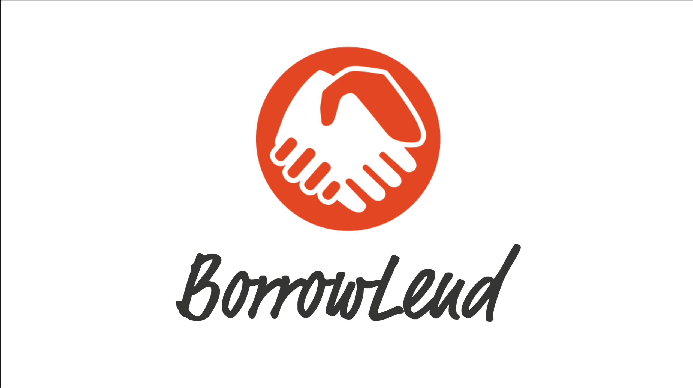
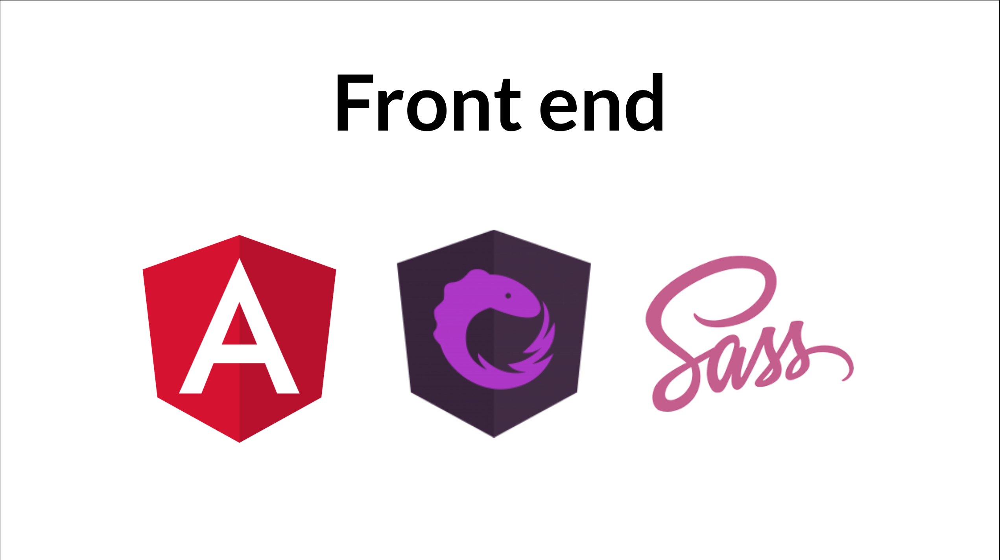
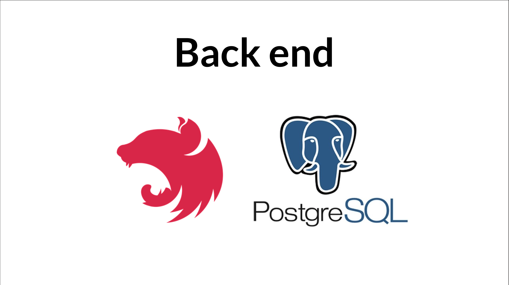

# **BorrowLend**

 

BorrowLend is a web app aimed at borrowing and lending items like books, games or movies. Each user can add the items that they want to borrow in the "to borrow list" and the item they want to lend in the "to lend list". If there is a match the two users can exchange the items and exchange them back after a certain amount of time.

## **Screenshots**

 

## **Demo video**
https://www.youtube.com/watch?v=wgbuKKT4rJ4&ab_channel=FrancescoFagnani

## **Tech Stack**
### **Front end**
* [Angular](https://angular.io/)
* [NGRX](https://ngrx.io/)
* [Sass](https://sass-lang.com/)

 

### **Back end**
* [NestJS](https://nestjs.com/)
* [PostgreSQL](https://www.postgresql.org/)

 

